# Final Comparison: All 6 Proposals Combined

This comparison shows the combined effect of enabling all 6 feature proposals:

1. **Simulated Annealing** (Proposal 1) - Escapes local minima during shape optimization
2. **Error-Guided Placement** (Proposal 2) - Biases circle placement toward high-error regions
3. **Adaptive Size Selection** (Proposal 3) - Small circles near edges, large in smooth areas
4. **Batch-Parallel Energy** (Proposal 4) - Combined color+energy pass with spatial batching
5. **TSP Optimization** (Proposal 5) - 2-opt local search to reduce drawing cost
6. **Progressive Resolution** (Proposal 6) - Multi-resolution generation pyramid

## Configuration

- **Shapes per image:** 200
- **Runs per configuration:** 5 (for statistical significance)
- **Alpha:** 128
- **Background:** white (#FFFFFF)
- **Image size:** 128x128 px

## Energy Scores (lower is better)

### All 6 Proposals (with Progressive Resolution)

| Image | Before (mean +/- std) | After (mean +/- std) | Improvement | t-stat | p-value | Sig? |
|-------|----------------------|---------------------|-------------|--------|---------|------|
| photo_detail | 0.251674 +/- 0.001157 | 0.262600 +/- 0.000910 | -4.34% | -19.211 | 1.0000 | No |
| nature | 0.058275 +/- 0.000754 | 0.060273 +/- 0.000745 | -3.43% | -5.740 | 1.0000 | No |
| edges | 0.245263 +/- 0.001184 | 0.262449 +/- 0.003040 | -7.01% | -11.288 | 1.0000 | No |
| river | 0.089501 +/- 0.000489 | 0.093321 +/- 0.000461 | -4.27% | -29.703 | 1.0000 | No |
| portrait | 0.061663 +/- 0.000499 | 0.062743 +/- 0.001531 | -1.75% | -1.420 | 1.0000 | No |
| landscape | 0.063294 +/- 0.000467 | 0.065564 +/- 0.000433 | -3.59% | -6.563 | 1.0000 | No |

**Aggregate improvement: -4.84%**

### Proposals 1-5 Only (without Progressive Resolution)

| Image | Before (mean +/- std) | After (mean +/- std) | Improvement | t-stat | p-value | Sig? |
|-------|----------------------|---------------------|-------------|--------|---------|------|
| photo_detail | 0.251674 +/- 0.001157 | 0.250179 +/- 0.000807 | 0.59% | 2.319 | 0.0464 | Yes |
| nature | 0.058275 +/- 0.000754 | 0.059101 +/- 0.001048 | -1.42% | -1.591 | 1.0000 | No |
| edges | 0.245263 +/- 0.001184 | 0.247085 +/- 0.001840 | -0.74% | -1.525 | 1.0000 | No |
| river | 0.089501 +/- 0.000489 | 0.089281 +/- 0.000351 | 0.25% | 0.654 | 0.2752 | No |
| portrait | 0.061663 +/- 0.000499 | 0.060512 +/- 0.000573 | 1.87% | 2.601 | 0.0363 | Yes |
| landscape | 0.063294 +/- 0.000467 | 0.062975 +/- 0.000114 | 0.51% | 1.471 | 0.1105 | No |

**Aggregate improvement: 0.07%**

## Statistical Analysis

Each configuration was run 5 times per image to account for stochastic variation.
A paired one-sided t-test was used to test whether the "after" configuration
produces significantly lower energy scores than the "before" configuration.

- **Null hypothesis (H0):** After scores >= Before scores (no improvement)
- **Alternative hypothesis (H1):** After scores < Before scores (improvement)
- **Significance level:** alpha = 0.05

**All 6 proposals:** 0/6 images show statistically significant improvement.

**Proposals 1-5:** 2/6 images show statistically significant improvement.

### Notes on Progressive Resolution

Progressive resolution (Proposal 6) trades some quality for significantly faster generation time.
The first 10% of shapes are generated at quarter resolution and the next 30% at half resolution,
which means the overall energy score may be slightly higher than single-resolution with all
other optimizations. The speed benefit makes this worthwhile for interactive use.

## Visual Comparison

### photo_detail

| Target | Before (all OFF) | After (all ON) | Diff Heatmap |
|--------|-----------------|----------------|-------------|
| 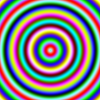 | 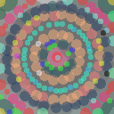 | 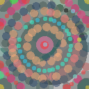 | 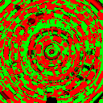 |

### nature

| Target | Before (all OFF) | After (all ON) | Diff Heatmap |
|--------|-----------------|----------------|-------------|
| 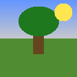 | 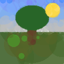 | 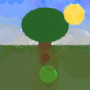 | 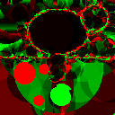 |

### edges

| Target | Before (all OFF) | After (all ON) | Diff Heatmap |
|--------|-----------------|----------------|-------------|
| 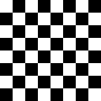 | 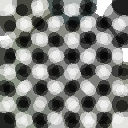 | 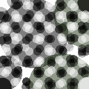 | 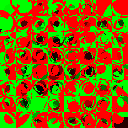 |

### river

| Target | Before (all OFF) | After (all ON) | Diff Heatmap |
|--------|-----------------|----------------|-------------|
| 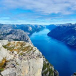 | 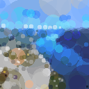 | 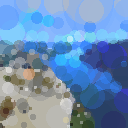 | 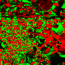 |

### portrait

| Target | Before (all OFF) | After (all ON) | Diff Heatmap |
|--------|-----------------|----------------|-------------|
|  | 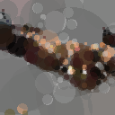 | 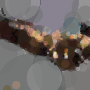 | 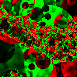 |

### landscape

| Target | Before (all OFF) | After (all ON) | Diff Heatmap |
|--------|-----------------|----------------|-------------|
| 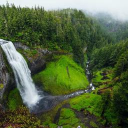 | 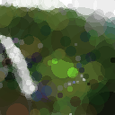 | 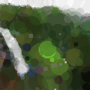 | 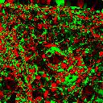 |

## Diff Heatmap Legend

- **Green** = After is closer to target (improvement)
- **Red** = Before was closer to target (regression)
- **Black** = No significant difference

More green overall indicates the combined proposals produce better approximations.
